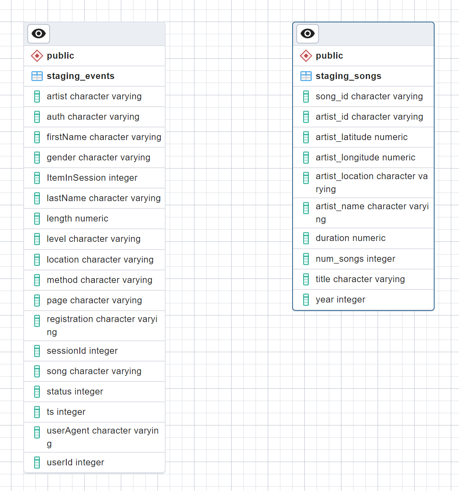
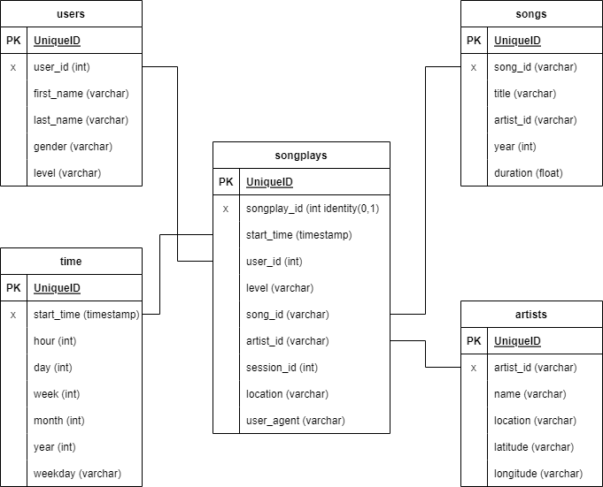
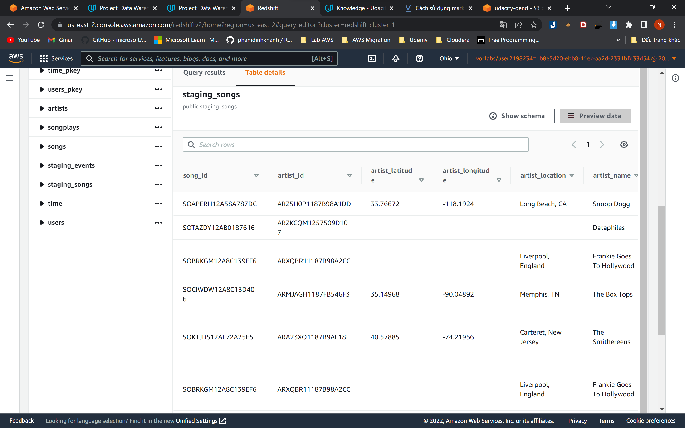
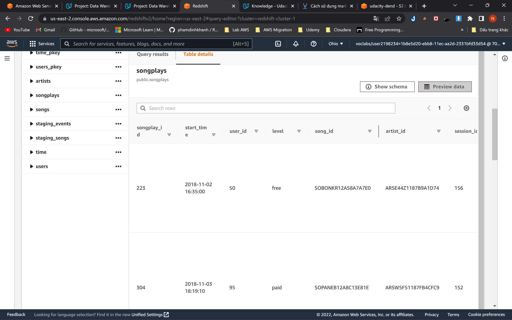

# Udacity-Data-Warehouse  


## Project Datasets
* Song dataset: 's3://udacity-dend/song_data'  
* Log dataset: 's3://udacity-dend/log_data'  
* Log data json path: s3://udacity-dend/log_json_path.json

### Song Dataset  
The first dataset is a subset of real data from the Million Song Dataset. Each file is in JSON format and contains metadata about a song and the artist of that song. The files are partitioned by the first three letters of each song's track ID. For example, here are filepaths to two files in this dataset.
```
song_data/A/B/C/TRABCEI128F424C983.json
song_data/A/A/B/TRAABJL12903CDCF1A.json
```
And below is an example of what a single song file, TRAABJL12903CDCF1A.json, looks like.
```
{"num_songs": 1, "artist_id": "ARJIE2Y1187B994AB7", "artist_latitude": null, "artist_longitude": null, "artist_location": "", "artist_name": "Line Renaud", "song_id": "SOUPIRU12A6D4FA1E1", "title": "Der Kleine Dompfaff", "duration": 152.92036, "year": 0}
```
### Log Dataset  
The second dataset consists of log files in JSON format generated by this event simulator based on the songs in the dataset above. These simulate app activity logs from an imaginary music streaming app based on configuration settings.
The log files in the dataset will be working with are partitioned by year and month. For example, here are filepaths to two files in this dataset.
```
log_data/2018/11/2018-11-12-events.json
log_data/2018/11/2018-11-13-events.json
```
## Fact Table  
1. songplays - records in log data associated with song plays i.e. records with page NextSong
 
## Dimension Tables  
2. users - users in the app   
3. songs - songs in music database  
4. artists - artists in music database 
5. time - timestamps of records in songplays broken down into specific units
 
  
## Project Template
1. `create_table.py`
2. `etl.py`  
3. `sql_queries.py`   
4. `README.md`

## Project Steps
Below are steps you can follow to complete each component of this project.

#### Create Table Schemas
1. Design schemas for your fact and dimension tables
2. Write a SQL CREATE statement for each of these tables in `sql_queries.py`
3. Complete the logic in `create_tables.py` to connect to the database and create these tables
4. Write SQL DROP statements to drop tables in the beginning of `create_tables.py` if the tables already exist. This way, you can run `create_tables.py` whenever you want to reset your database and test your ETL pipeline.
5. Launch a redshift cluster and create an IAM role that has read access to S3.
6. Add redshift database and IAM role info to `dwh.cfg`.
7. Test by running `create_tables.py` and checking the table schemas in your redshift database. You can use Query Editor in the AWS Redshift console for this.
#### Build ETL Pipeline
1. Implement the logic in `etl.py` to load data from S3 to staging tables on Redshift.
2. Implement the logic in `etl.py` to load data from staging tables to analytics tables on Redshift.
3. Test by running `etl.py` after running `create_tables.py` and running the analytic queries on your Redshift database to compare your results with the expected results.
4. Delete your redshift cluster when finished.

## How to run scripts

Step 1: Set environment variables `KEY` and `SECRET`.

Step 2: Choose `DB/DB_PASSWORD` in `dhw.cfg`.

Step 3: Create IAM role, Redshift cluster, connect to S3 bucket and configure TCP connectivity  

Step 4: Drop and recreate tables

```bash
$ python create_tables.py
```

Step 5: Run ETL pipeline

```bash
$ python etl.py
```  

Step 6: Validate the tables    
* Open the Amazon Redshift and use the database info to make a connection.   

Step 7: Delete IAM role and Redshift cluster

## Result:    
 
This is staging song table and data in this!!!


This is SongPlays table and data in this!!!


